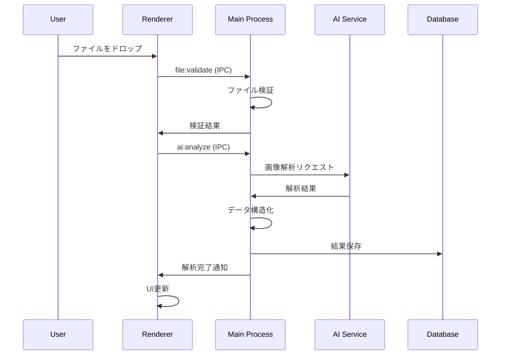
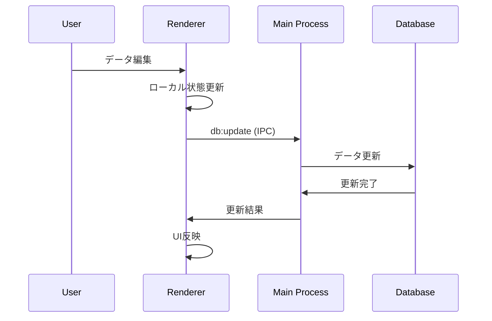

# アーキテクチャドキュメント

## 概要

Drawing Insight Desktopは、Electron.jsベースのデスクトップアプリケーションで、AI技術を活用した図面解析システムです。

## システム構成

### 高レベルアーキテクチャ

```
┌─────────────────┐    ┌─────────────────┐    ┌─────────────────┐
│   ユーザー       │    │  外部AIサービス   │    │  ローカルDB      │
│   Interface     │    │  (OpenAI/Google) │    │  (SQLite)       │
└─────────────────┘    └─────────────────┘    └─────────────────┘
         │                       │                       │
         │                       │                       │
         ▼                       ▼                       ▼
┌─────────────────────────────────────────────────────────────────┐
│                    Electron Application                         │
│ ┌─────────────────┐                    ┌─────────────────────┐  │
│ │ Renderer Process│                    │   Main Process      │  │
│ │                 │                    │                     │  │
│ │ ┌─────────────┐ │  IPC Communication │ ┌─────────────────┐ │  │
│ │ │ React UI    │ │ ◄─────────────────► │ │ File Handler    │ │  │
│ │ │             │ │                    │ │                 │ │  │
│ │ │ Components: │ │                    │ │ AI Service      │ │  │
│ │ │ - FileUpload│ │                    │ │                 │ │  │
│ │ │ - Progress  │ │                    │ │ Database        │ │  │
│ │ │ - ResultTable│ │                   │ │                 │ │  │
│ │ └─────────────┘ │                    │ │ Security        │ │  │
│ └─────────────────┘                    │ └─────────────────┘ │  │
└─────────────────────────────────────────────────────────────────┘
```

## プロセス構成

### メインプロセス（Node.js）

#### 責任範囲
- アプリケーションのライフサイクル管理
- ファイルシステムへのアクセス
- 外部API通信
- データベース操作
- セキュリティ管理

#### 主要コンポーネント

```typescript
// main.ts - アプリケーションエントリーポイント
BrowserWindow作成
メニュー設定
アプリケーションイベント処理

// fileHandler.ts - ファイル操作
interface FileHandler {
  validateFile(file: File): Promise<ValidationResult>
  readFile(path: string): Promise<Buffer>
  saveTemporaryFile(data: Buffer): Promise<string>
  cleanupTemporaryFiles(): Promise<void>
}

// aiService.ts - AI API連携
interface AIService {
  analyzeDrawing(imageBuffer: Buffer): Promise<AnalysisResult>
  extractDimensions(analysis: any): Dimension[]
  extractPartsList(analysis: any): Part[]
  extractMaterials(analysis: any): Material[]
}

// database.ts - データベース管理
interface DatabaseService {
  initialize(): Promise<void>
  saveAnalysis(analysis: AnalysisResult): Promise<string>
  getAnalyses(filters?: FilterOptions): Promise<AnalysisResult[]>
  updateAnalysis(id: string, data: Partial<AnalysisResult>): Promise<void>
  deleteAnalysis(id: string): Promise<void>
}
```

### レンダラープロセス（React）

#### 責任範囲
- ユーザーインターフェース
- ユーザー操作の処理
- データの表示
- プレゼンテーション層のロジック

#### コンポーネント構成

```
App.tsx
├── Layout (Ant Design)
│   ├── Sider (Navigation)
│   ├── Header (Title)
│   └── Content
│       ├── FileUpload.tsx
│       │   ├── Dragger (File drop zone)
│       │   ├── FileList (Uploaded files)
│       │   └── ValidationMessages
│       │
│       ├── AnalysisProgress.tsx
│       │   ├── ProgressBar
│       │   ├── StatusIndicator
│       │   └── ErrorDisplay
│       │
│       └── ResultTable.tsx
│           ├── DataTable (Ant Design Table)
│           ├── FilterControls
│           ├── EditableCell
│           └── ExportButtons
```

## データフロー

### ファイルアップロード・解析フロー



### データ編集フロー



## 通信層（IPC）

### セキュアな通信設計

```typescript
// preload.ts - Context Bridge
contextBridge.exposeInMainWorld('electronAPI', {
  // ファイル操作
  uploadFile: (filePath: string) => ipcRenderer.invoke('file:upload', filePath),
  validateFile: (file: FileInfo) => ipcRenderer.invoke('file:validate', file),
  
  // AI解析
  analyzeImage: (fileId: string) => ipcRenderer.invoke('ai:analyze', fileId),
  
  // データベース操作
  saveAnalysis: (analysis: AnalysisResult) => ipcRenderer.invoke('db:save', analysis),
  getAnalyses: (filters?: FilterOptions) => ipcRenderer.invoke('db:getAll', filters),
  updateAnalysis: (id: string, data: any) => ipcRenderer.invoke('db:update', id, data),
  
  // エクスポート
  exportData: (format: string, data: any[]) => ipcRenderer.invoke('export:data', format, data),
  
  // イベントリスナー
  onProgress: (callback: (progress: ProgressInfo) => void) => {
    ipcRenderer.on('analysis:progress', (_, progress) => callback(progress));
  },
  
  onError: (callback: (error: ErrorInfo) => void) => {
    ipcRenderer.on('analysis:error', (_, error) => callback(error));
  }
});
```

## データモデル

### 核となるエンティティ

```typescript
// DrawingFile - アップロードされた図面ファイル
interface DrawingFile {
  id: string;                    // UUID
  name: string;                  // ファイル名
  originalName: string;          // 元のファイル名
  path: string;                  // 一時保存パス
  size: number;                  // ファイルサイズ（bytes）
  type: FileType;                // ファイル形式
  uploadedAt: Date;              // アップロード日時
  checksum: string;              // ファイルの整合性チェック用
}

// AnalysisResult - AI解析結果
interface AnalysisResult {
  id: string;                    // UUID
  fileId: string;                // 関連する図面ファイルID
  status: AnalysisStatus;        // 解析状況
  
  // 解析データ
  title?: string;                // 図面タイトル
  drawingNumber?: string;        // 図番
  dimensions: Dimension[];       // 寸法情報
  partsList: Part[];            // 部品リスト
  materials: Material[];         // 材質情報
  
  // メタデータ
  analyzedAt: Date;             // 解析実行日時
  processingTime: number;        // 処理時間（ms）
  aiModel: string;              // 使用したAIモデル
  confidence: number;           // 解析の信頼度（0-1）
  
  // エラー情報
  error?: ErrorInfo;
}

// Dimension - 寸法情報
interface Dimension {
  id: string;
  label: string;                // 寸法の説明
  value: number;                // 数値
  unit: 'mm' | 'cm' | 'm' | 'inch'; // 単位
  type: DimensionType;          // 寸法の種類
  position?: Coordinate;        // 図面上の位置
  tolerance?: Tolerance;        // 公差情報
}
```

## セキュリティアーキテクチャ

### セキュリティ原則

1. **最小権限の原則**: 各プロセスは必要最小限の権限のみ
2. **深層防御**: 複数の層でセキュリティを実装
3. **データ暗号化**: 機密データは暗号化して保存
4. **入力検証**: 全ての入力データを検証

### 実装レベルでのセキュリティ

```typescript
// セキュアなBrowserWindow設定
const secureWindowConfig = {
  webPreferences: {
    nodeIntegration: false,           // Node.js統合を無効化
    contextIsolation: true,           // コンテキスト分離を有効化
    enableRemoteModule: false,        // remoteモジュールを無効化
    preload: path.join(__dirname, 'preload.js'),
    sandbox: true,                    // サンドボックス化
    webSecurity: true                 // Webセキュリティを有効化
  }
};

// データベース暗号化
const dbConfig = {
  encryption: {
    algorithm: 'AES-256-GCM',
    keyDerivation: 'PBKDF2'
  }
};

// API通信のセキュリティ
const apiSecurityHeaders = {
  'Content-Type': 'application/json',
  'User-Agent': 'DrawingInsight/1.0.0',
  'X-Request-ID': generateRequestId()
};
```

## パフォーマンス設計

### 最適化戦略

1. **非同期処理**: 重い処理はメインスレッドをブロックしない
2. **メモリ管理**: 大きなファイルは分割処理
3. **キャッシング**: よく使用されるデータをキャッシュ
4. **遅延読み込み**: 必要時にコンポーネントを読み込み

```typescript
// ファイル分割処理の例
async function processLargeFile(file: File): Promise<AnalysisResult> {
  const CHUNK_SIZE = 1024 * 1024; // 1MB chunks
  
  for (let offset = 0; offset < file.size; offset += CHUNK_SIZE) {
    const chunk = file.slice(offset, offset + CHUNK_SIZE);
    await processChunk(chunk);
    
    // UIの応答性を保つため、次のチャンクまでイベントループを解放
    await new Promise(resolve => setImmediate(resolve));
  }
}
```

## エラーハンドリング

### エラー分類と処理

```typescript
// エラー階層
abstract class AppError extends Error {
  abstract readonly code: string;
  abstract readonly category: ErrorCategory;
}

class ValidationError extends AppError {
  code = 'VALIDATION_ERROR';
  category = ErrorCategory.UserInput;
}

class NetworkError extends AppError {
  code = 'NETWORK_ERROR';
  category = ErrorCategory.External;
}

class DatabaseError extends AppError {
  code = 'DATABASE_ERROR';
  category = ErrorCategory.Internal;
}

// グローバルエラーハンドラー
process.on('uncaughtException', (error) => {
  logger.error('Uncaught Exception:', error);
  // 適切なクリーンアップ処理
  gracefulShutdown();
});
```

## ログ・監視

### ログ設計

```typescript
interface LogEntry {
  timestamp: Date;
  level: LogLevel;
  category: string;
  message: string;
  metadata?: Record<string, any>;
  userId?: string;
  sessionId: string;
}

// 構造化ログ
logger.info('File analysis started', {
  fileId: 'abc123',
  fileName: 'drawing.pdf',
  fileSize: 1024000,
  aiModel: 'gpt-4-vision'
});
```

## 拡張性

### プラグインアーキテクチャ（将来実装）

```typescript
interface AnalysisPlugin {
  name: string;
  version: string;
  analyze(input: AnalysisInput): Promise<AnalysisOutput>;
}

// プラグインマネージャー
class PluginManager {
  registerPlugin(plugin: AnalysisPlugin): void;
  getPlugin(name: string): AnalysisPlugin | undefined;
  executePlugin(name: string, input: AnalysisInput): Promise<AnalysisOutput>;
}
```

## デプロイ・配布

### ビルドアーティファクト

```
release/
├── win-unpacked/          # Windows実行ファイル
├── mac/                   # macOS app bundle
├── linux-unpacked/        # Linux実行ファイル
└── installers/            # インストーラー
    ├── setup.exe          # Windows installer
    ├── app.dmg            # macOS installer
    └── app.AppImage       # Linux AppImage
```

### 自動更新システム（将来実装）

```typescript
// 更新チェック
interface UpdateService {
  checkForUpdates(): Promise<UpdateInfo | null>;
  downloadUpdate(updateInfo: UpdateInfo): Promise<string>;
  installUpdate(updatePath: string): Promise<void>;
}
```

## 運用・メンテナンス

### 診断機能

```typescript
interface DiagnosticInfo {
  app: {
    version: string;
    platform: string;
    architecture: string;
  };
  system: {
    memory: MemoryInfo;
    disk: DiskInfo;
    network: NetworkInfo;
  };
  database: {
    size: number;
    recordCount: number;
    lastBackup: Date;
  };
}
```

このアーキテクチャにより、スケーラブルで保守しやすく、セキュアなElectronアプリケーションを実現します。